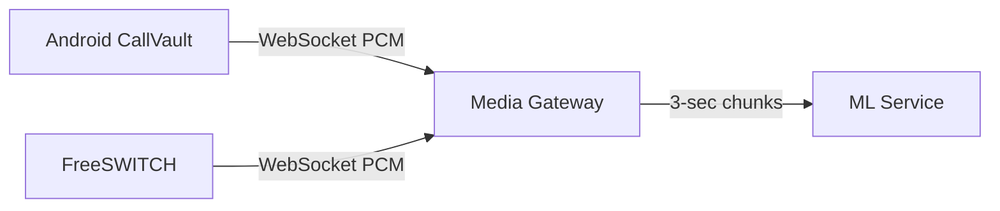

# Architecture

**CallVault (Android)**: A third-party FOSS call recording app, forked and extended. Runs a privileged daemon (`RecorderServer`) via embedded ADB shell. The daemon captures phone call audio at 48 kHz mono PCM16 using `DirectAudioRecorderSession`. We added a `WebSocketAudioSink` class (OkHttp) that connects to the Media Gateway over `ws://` and sends: `session.start` JSON, raw PCM binary frames, `session.stop` JSON. The WebSocket runs in the daemon process alongside the encoder — network errors are swallowed so local recording is never affected. Gateway URL and session ID are passed through the AIDL interface (`IRecorderService.startRecording`) from the app's SharedPreferences, through `RecorderServer`, into `DirectAudioRecorderSession`. The user configures the gateway URL in the CallVault Settings screen. `minSdkVersion=30`, `targetSdkVersion=36`. OkHttp 4.12.0. Cleartext traffic enabled in AndroidManifest.

**Media Gateway (Node.js/TypeScript)**: HTTP + WebSocket server on port 8010 (0.0.0.0). Two WebSocket endpoints: `/` for audio sources (CallVault, FreeSWITCH), `/dashboard` for the browser dashboard. Audio sources send `session.start` JSON with `session_id`, `source`, `sample_rate`, `channels`, `encoding`. Then raw PCM binary frames. Then `session.stop`. The gateway manages sessions via `SessionManager`. Each session has an `AudioChunker` that buffers incoming PCM and produces exact 3-second chunks. Chunk size is calculated: `sampleRate × channels × bytesPerSample × durationSec`. For 48 kHz mono PCM16 = 288,000 bytes/chunk. Chunks are forwarded to the ML service via `MlClient` WebSocket. A `DebugRecorder` optionally saves raw PCM to disk. The dashboard shows live RMS levels per session. Health endpoint at `/health`.

**ML Service**: Not yet integrated. The gateway connects to `ws://localhost:8011` and sends `audio.chunk` JSON metadata followed by binary PCM payload. The ML service will run deepfake detection on each chunk.

**FreeSWITCH**: NOT YET INTEGRATED. Planned as a SIP-based telephony ingestion source using the same WebSocket protocol.
